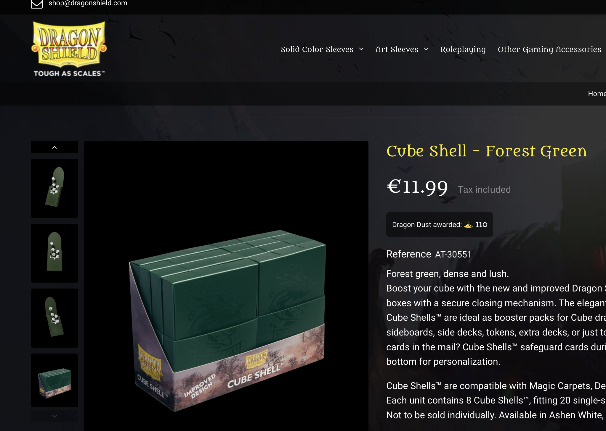
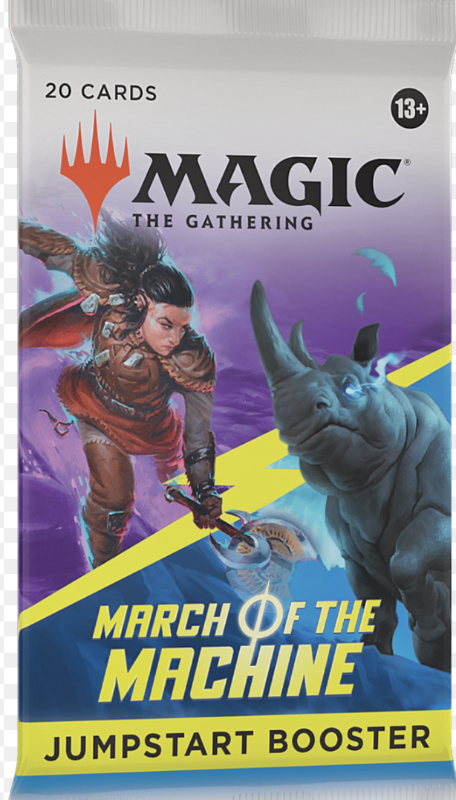
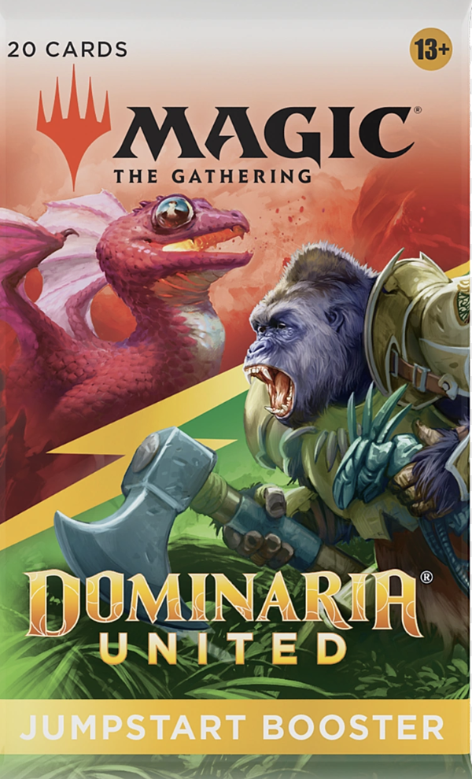

# Jumpstart
A new format meant to avoid deckbuilding and quickly get into games.

Buy 2 packs (20 cards each, lands included), open, shuffle, play.

## Re-Usability
One can sleeve and store the packs for later use, they dont need to be single use.

[There are Deck Boxes meant for this](https://www.dragonshield.com/webshop/deck-boxes/404-cube-shell-forest-green.html?_gl=1*i2xlmp*_up*MQ..&gclid=EAIaIQobChMI0Ij_gKi4gAMV2RB7Ch2GxwjREAAYASABEgI8rvD_BwE), I plan on buying a few, so that i can later reuse these packs.

# Jumpstart sets: Jumpstart and Jumpstart 2022
Each one has like 30-40 different packs, not likely to get duplicates

Original Jumpstart: 

Jumpstart 2022: 

---
# Non-Jumpstart sets
These are packs meant to supplement the main sets that are printed, but give a bit of the Jumpstart gameplay (buy 2, shuffle, play). 
Unfortunately, these have very little replayability. Only a total of 10 different packs, but that is mostly a lie. They announce 2 packs per color, but with so many cards in common, in reality it ends up being 1 pack per color. 

At most, buy 3 Jumpstart boosters from each of the Non-Jumpstart sets.

Examples are:
- March of the Machines

- Lord of the Rings
- [Dominaria United](https://mtg.fandom.com/wiki/Dominaria_United/Jumpstart)

- [The brothers war ](https://mtg.fandom.com/wiki/The_Brothers%27_War/Jumpstart)