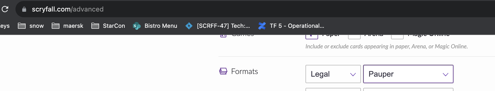

# Pauper, where commons are king

If a card has ever been printed (either physically or on MTGO) as common, it is pauper legal.  

One of the easiest sites to check is [scryfall, use the advanced search](https://scryfall.com/advanced)

## Banlist
Since some toys can be too fun and too dangerous, there is a banlist: 
https://magic.wizards.com/en/banned-restricted-list#Pauper-banned

## Metagame
Quite a few websites list the most popular decks. They can be a nice starting point:
- https://mtgdecks.net/Pauper
- https://www.mtggoldfish.com/metagame/pauper#paper

## More links
https://magic.wizards.com/en/formats/pauper