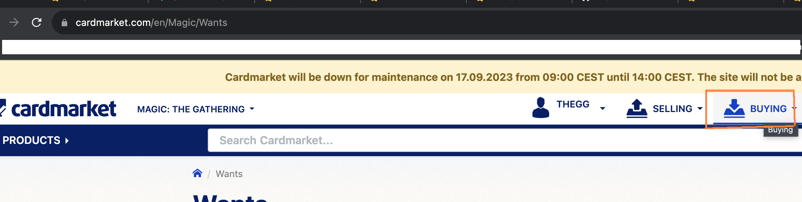

# Why buy singles?
When you buy boosters, it is highly likely that you will have no use for most of the cards in there (honorable mention for Jumpstart boosters, why I see a bit like a Board game, in the sense that it can be self contained).  

Pre-built decks (nowadays, only commander decks and starter decks are available) are also ok, especially if we play pre-built decks with no changes at all.

# Something to try
I never tried this, but I imagine that a post in a Facebook Group saying that you want to buy a complete Pauper deck (and then specify which deck, if you care), could be a simple idea. I can see a post like: "I am looking to buy a Pauper Elves/Burn/Affinity/whatever deck. Anyone wants to sell?".  
If this works it's an instant way to get a full deck, without so much hassle

# Danish online shops

NOTE: These can also be found in Cardmarket. Danish sellers will typically arrive faster. Good when you don't want to wait.

Good experiences:
- [thecardcollective.dk](https://thecardcollective.dk/collections/mtg-singles-instock) - They send the cards immidiately and only display cards in stock.

Less good experiences:
- [kelz0r.dk](https://www.kelz0r.dk/magic/magic-enkeltkort-singles-c-23_24.html) - They will often not have cards displayed on their website, you will likely not get all cards ordered and in my experience will have to wait long time for some cards (think weeks)

# Where to buy singles?
You can try your local game store, I dont know what/how much is available in KBH/surroundings.

There are some Facebook groups, do that at your own discretion (also DBA). 

My main recommendation is [Cardmarket](https://www.cardmarket.com/en/Magic). You can get many cards for pennies (sometimes like 0,02e for a playset = 4 copies of a card). Of course there is also the shipping costs, but you will always need to pay those somewhere. 

Unless you want a single card (and most likely you want most cards in a deck), use the Shopping Wizard to minimize costs. There are many cases where I end up paying more for Shipping than the cards themselves, and the wizard choosing the best combination of sellers and quantities is a huge blessing 

Follow the steps below:

1. Click Buying 
  
1. Select My Wants  
  
1. Add a deck list. I cant help to decide which decks you like, but [try something from here](https://www.mtggoldfish.com/metagame/pauper#paper)    
  
1. After having selected card languages, editions, if you want foils or not, you can then start the wizard. You can see the languages that I wanted (basically the ones that I can read)   
1. Select Europe. You dont want SKAT/Customs and the postnord 150dkk fee   
1. Up to you now! Low price, or, small ammount of shipments   
1. An example of part of my card 

## Shipping
https://help.cardmarket.com/en/ShippingCosts  
| Weight   	|  Max cards  	|
|---	|---	|
| 20g	|  4	|
| 50g	|  17	|
| 100g	|  40	|

### Cheapest Places (shipping to DK, prices in Euro)

| Country	| 4 cards	| 5-17 cards	| 18-40 	|
|---	|---	|---	|---	|
| Bulgaria	| 1.74	| xx	| 2,73	|
| Cyprus (tax??)	| 0.94 	| 1.3	| 2	|
| Czech	| x	| 2,15	| 3.11	|
| DK 	| x 	| 1.97	| 3.83	|
| Germany	| 1.40	| x	| x	|
| Lithuania	| 1.7	| 2.05	| 2.6	|
| Luxembourg	| x	| 1.7	| x	|
| Portugal	| x	| x	| 2.6	|
| Slovakia	| x	| 1.80	| 2.6	|
| Spain	| x	| 2.25	| 3.25	|

