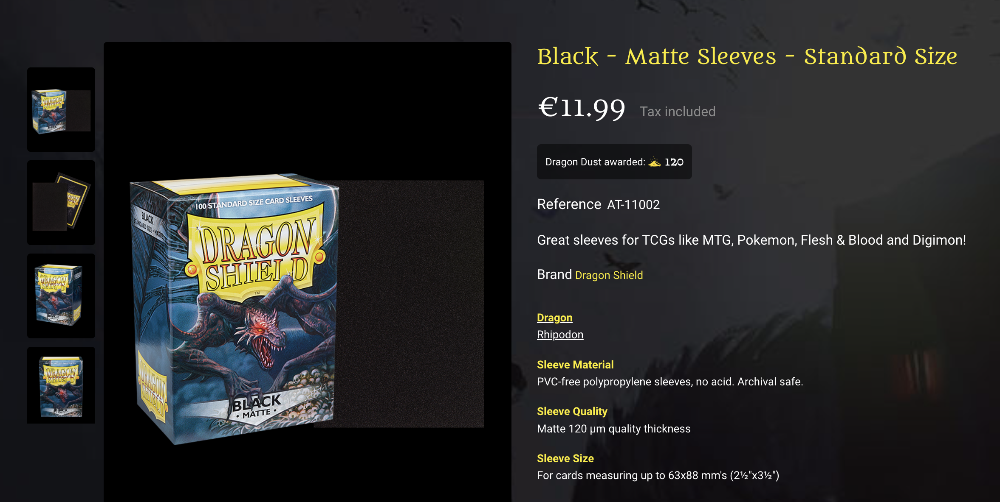

# NEVER BUY PENNY SLEEVES OR SOFT SLEEVES
Useless crap, very cheap, terrible.

## Constructed -> Prebuilt decks (60 to 100 cards)
Up to you, some recommendations (I have yet to try the Katana's. Someone get them, they seem to be the Best noe). Matte's in general make shuffling better/easier. Buy something you like, funky art, crazy colors, whatever floats your boat:
- Dragon Shield Matte
- Ultimate Guard Katana
- KMC HyperMatte
- UltraPro Eclipse

## Jumpstart Sleeves 
By all using the same sleeve, it means that the packs can be mixed together. Therefore, we agreed on the below:  

Dragon Shield Matte (not the dual matte) Black (not Jet, those have a metallic look) -> https://www.dragonshield.com/webshop/solid-color-sleeves/70-dragon-shield-matte-black.html

  
Jumpstart Sleeves (Obsolete)

  
    ### Jumpstart
    Gamegenic Just Sleeves (box of 250). They seem to be [discontinued, this is their current offerings](https://www.gamegenic.com/product-category/card-sleeves/standard-sleeves/value-pack-200/), but since they are clear, should not be an issue to mix with other brands. 

    I imagine that since the jumpstart will not be used that often, since we mix, getting a total of 500 of these clear is perfect for jumpstart. 3 players is 120 sleeves per session, so, 500 is at least 4 gaming sessions, more if we reuse packs (hence the boxes, see paragraph below)

    https://www.kelz0r.dk/magic/gamegenic-just-sleeves-standard-card-game-size-value-pack-clear-transparentgennemsigtig-250-kortlommer-p-268914.html?utm_source=daisycon&utm_medium=affiliate&utm_campaign=daisycon_adstrong

## Jumpstart Deck Box
See the Jumpstart page. These boxes can be any color, and this isnt that critical. We can roll a dice, they serve only to store the used packs in a convenient way.

Hell, a cassette/tape (yes, the very old music thing) plastic box also works to store magic cards, I used to do that as a kid.

### Double and Triple Sleeving
If you really want to protect your cards, consider double sleeving (done with a "perfect size" inner sleeve) and a normal sleeve.  
For triple sleeving there are "outer sleeves".  
The decks get a lot thicker and harder to handle. For now, single sleeving is fine.  
